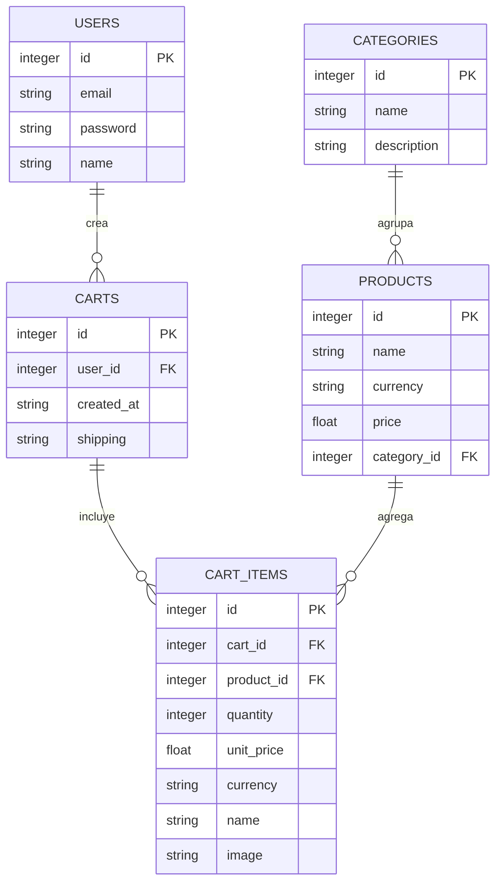

# Acta documental

Dejé un diagrama MER sencillo para el eCommerce y un mini resumen del backend que armé.

- El SQL que crea estas tablas está en `backend/ecommerce.sql`.
- El backend está en `backend/` con Express, usa JWT para la sesión y lee los JSON en `backend/data/`.
- Credenciales de prueba para el login: `usuario@correo.com` / `123456`.
